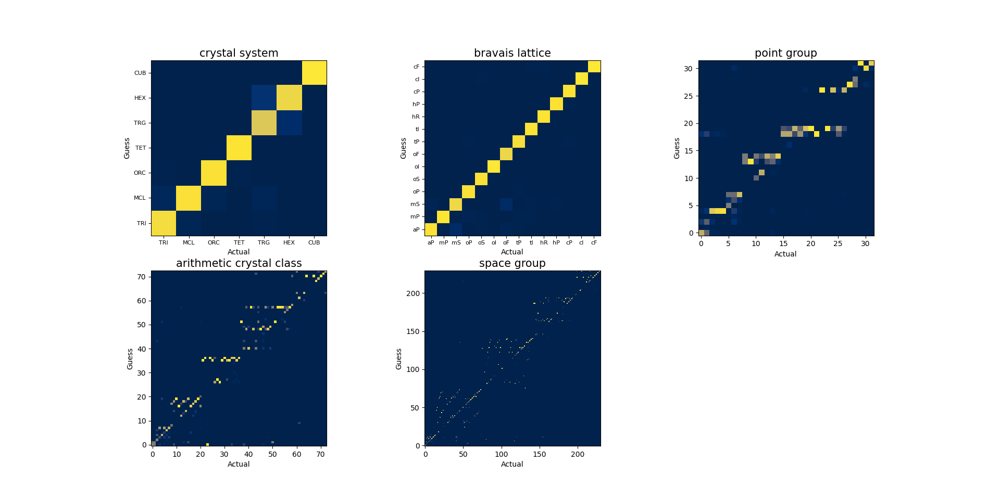

 ## Instruction
 1. change in_data_dir in main_preparation to specify the directory of data 
 
 2. run main_preparation to prepare directory and list files
 
 3. run main_XX2XX to train the neural network and guess list files
 
 4. run main_analysis to see confusion matrix
 
Confusion matrix:

## Details 
### Prepare data
1. download data from [material project](https://materialsproject.org/) using [pymatgen](https://pymatgen.org/)'s api

2. formate data using [Bin's code](https://github.com/binxi0629/NN-project/tree/master/format_data)

3. main_preparation.py, function_list.py --- create a list containing the address of data
    - id of data run from 0 to 1M, but not all are available
    - this has to be done every time the data pack is changed because data in each pack may be different

4. main_preparation.py, function_list.py --- create a list for each spacegroup containing address of data in that spacegroup
    - 230 in total
    - the label of spacegroup is available in the json file downloaded

### Prepare training

1. define the structure of the neural network --- main_training.py
    1. size of each layer (number of input, number of output)
    2. activation function between each layer

2. choose how to train --- main_training.py
    1. optimizer
        - method of optimization (predict the direction towards minimum of the criterion)
        - usually Adam
    2. scheduler
        - method of updating the learning rate each epoch
    3. criterion
        - method of determining the performance of the neural network
        - usually Cross Entropy Loss for classification

3. create dataset --- main_training.py, data_loader.py
    1. read id list
    2. open the file of the corresponding id
    3. load json
    4. store bandstructure and spacegroup number as two separate nd-array (matrix) in memory
        - bandstructure is the input data, array shape: (no of data, no of kpoint, no of band)
        - spacegroup number is the label, array shape: (no of data)

4. create dataloader object --- main_training.py, data_loader.py
    1. split the data into two part: Training, Validation
    2. sampler
        - how to sample data in a dataset

### Start training

1. train loop --- main_training.py, function_tranining.py
    1. get data from dataloader
        - do "to(device)" in order to use gpu (otherwise error would occur)
    2. feed data through network
    3. evaluate loss (using criterion)
    4. calculate gradient by calling loss.backward()
        - now the gradient is stored in memory
    5. update weight inside each layer of the neural network (using optimizer)

2. validate loop (check if the network is overfitting) --- main_training.py, function_training.py
    1. get data from dataloader
    2. feed data through network
    3. evaluate loss and check if the most probable one match with the label
    4. accumulate the loss and number of correct guess
    5. calculate the average performance

### After training

1. create spacegroup list base on prediction of the neural network --- main_training.py, function_list.py

2. evaluate performance, compare guessed result with answer --- main_analysis.py, function_analysis.py
    1. calculate True Positive, True Negative, False Positive, True Negative
    2. [calculate Accuracy, Precision, Sensitivity, etc.](https://towardsdatascience.com/accuracy-recall-precision-f-score-specificity-which-to-optimize-on-867d3f11124)
    3. calculate confusion matrix 